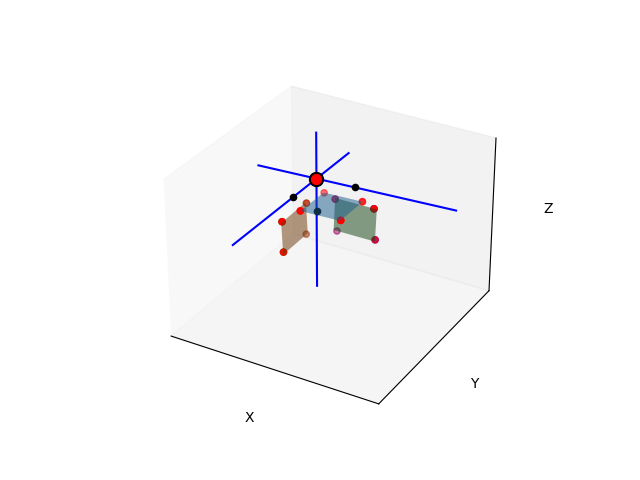

# Cube fitting

This code is intended to find the pose of a cube from a collection of surface points.

Three point clouds, each sampled from one face of the cube, are used to fit a plane and find cube edges from pairwise
plane intersections. The corner point of the cube is determined from the pairwise intersections of the edges.

